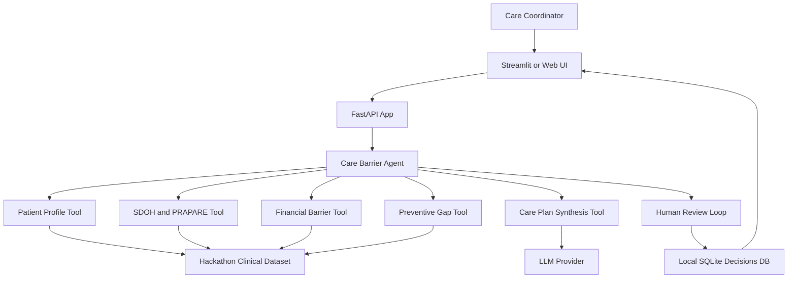
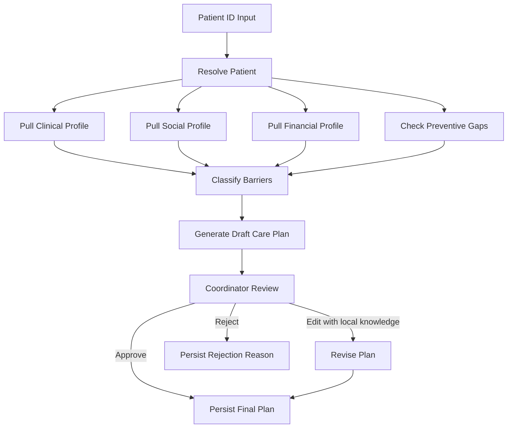

# Care Barrier Agent Architecture Plan

## Goal

Design and build a focused Python demo for Prompt 3: **The Care Barrier Agent** from [`prompts.md`](/Users/sanjanav/Desktop/hack/prompts.md). The product should work deeply for one protagonist patient first, then support any patient ID that has enough source data.

The agent should answer: **what barriers are preventing this patient from accessing care, what care gaps exist, and what barrier-informed plan should a coordinator review and personalize?**

## Recommended Python Stack

- **Backend/API:** FastAPI
- **Agent orchestration:** LangGraph or a lightweight custom Python state machine
- **LLM calls:** OpenAI-compatible client or local model wrapper behind an interface
- **Database access:** SQLAlchemy Core or DuckDB/SQLite depending on dataset format
- **Data validation:** Pydantic models for patient profiles, barriers, gaps, recommendations, and coordinator edits
- **Frontend/demo UI:** Streamlit for fastest hackathon delivery, or FastAPI + simple HTML if you want full control
- **Persistence:** SQLite for local writeback of coordinator decisions, edited plans, and follow-up tasks
- **Testing:** Pytest for core data tools, barrier logic, and plan synthesis inputs

## High-Level Architecture



## Core User Flow

1. Coordinator enters a patient ID or searches by messy Synthea name such as `Lindsay Brekke`.
2. App resolves the patient and displays a one-page summary.
3. Agent pulls:
   - Active clinical conditions from `conditions`
   - SDOH flags from `conditions`
   - PRAPARE responses from `observations`
   - Medications and possible adherence/polypharmacy/opioid concerns from `medications`
   - Outstanding medical debt from `claims_transactions` using `PATIENTID`
   - Missing preventive care and screening gaps from `procedures`
   - Active care plan status from `careplans`
4. Agent classifies barriers into clear categories:
   - Financial barriers
   - Transportation/logistical barriers
   - Housing/food/employment insecurity
   - Medication complexity or affordability concerns
   - Care coordination gaps
   - Preventive-care gaps
5. Agent generates a structured care plan with rationale and confidence.
6. Coordinator reviews the plan and adds local knowledge.
7. Agent revises the plan based on the coordinator input.
8. Final approved plan, edits, and follow-up tasks are persisted to SQLite.

## Python Package Layout

```text
care_barrier_agent/
  app/
    main.py                  # FastAPI entrypoint
    config.py                # DB paths, model config, feature flags
    dependencies.py          # shared DB/session/client wiring
  data/
    database.py              # SQLAlchemy/DuckDB connection helpers
    repositories.py          # table-specific query functions
    patient_lookup.py        # ID and fuzzy name lookup
  tools/
    clinical_profile.py      # conditions, medications, careplans
    social_profile.py        # SDOH conditions + PRAPARE observations
    financial_profile.py     # claims debt via PATIENTID
    preventive_gaps.py       # missing screenings/procedures
    synthesis.py             # structured care plan generation
  agent/
    state.py                 # Pydantic state object across the workflow
    graph.py                 # LangGraph/custom state-machine orchestration
    prompts.py               # LLM instructions and output schema guidance
    review.py                # coordinator edit handling and re-synthesis
  models/
    patient.py               # PatientSummary, PatientIdentity
    profile.py               # ClinicalProfile, SocialProfile, FinancialProfile
    barriers.py              # Barrier, BarrierEvidence, BarrierCategory
    care_plan.py             # CarePlan, Recommendation, Task, ReviewDecision
  persistence/
    decisions.py             # approved/rejected/edited plan storage
    schema.sql               # local SQLite tables for audit trail
  ui/
    streamlit_app.py         # demo interface
  tests/
    test_patient_lookup.py
    test_financial_profile.py
    test_barrier_classification.py
    test_review_loop.py
```

## Agent State Design

Use one typed state object so every step is inspectable and easy to demo:

```python
class CareBarrierState(BaseModel):
    patient_id: str
    patient_identity: PatientIdentity | None = None
    clinical_profile: ClinicalProfile | None = None
    social_profile: SocialProfile | None = None
    financial_profile: FinancialProfile | None = None
    preventive_gaps: list[PreventiveGap] = []
    barriers: list[Barrier] = []
    draft_plan: CarePlan | None = None
    coordinator_feedback: str | None = None
    final_plan: CarePlan | None = None
    decision: Literal["approved", "edited", "rejected"] | None = None
```

## Agent Workflow



## Tool Contracts

### `get_clinical_profile(patient_id)`

Returns active diagnoses, chronic conditions, active medications, care plan status, recent encounters if available, and medication complexity signals.

### `get_social_profile(patient_id)`

Returns SDOH-coded conditions and PRAPARE observations. The output should normalize raw observations into categories like housing, food, transport, stress, employment, safety, and social support.

### `get_financial_profile(patient_id)`

Queries `claims_transactions` by `PATIENTID`, not `PATIENT`, and returns outstanding balance, total charges, payments, claim count, and whether debt is likely a care-access barrier.

### `get_preventive_gaps(patient_id)`

Checks `procedures` and `careplans` for missing screenings, no active care plan, missing medication reconciliation, or overdue preventive interventions.

### `classify_barriers(profile_bundle)`

Deterministic Python logic first, LLM-assisted summarization second. This avoids a black-box demo and makes evidence traceable.

### `generate_care_plan(barriers, gaps, profiles)`

Produces a structured care plan with sections:

- Patient snapshot
- Top barriers with evidence
- Clinical priorities
- Social/financial interventions
- Preventive-care gaps
- Coordinator action checklist
- Suggested patient outreach language
- What to ask the coordinator during review

### `revise_plan_with_feedback(draft_plan, coordinator_feedback)`

Uses the coordinator’s local knowledge to change recommendations, timing, task assignment, or outreach language. This is the key human-in-the-loop feature judges will look for.

## Data Access Strategy

Keep raw SQL isolated in repository functions. Each tool should call repositories instead of embedding SQL directly. This makes the data layer testable and keeps the agent orchestration clean.

Example repository boundaries:

- `PatientRepository.find_by_id_or_name()`
- `ConditionRepository.active_for_patient()`
- `ObservationRepository.prapare_for_patient()`
- `MedicationRepository.active_for_patient()`
- `ClaimsRepository.financial_summary_by_patientid()`
- `ProcedureRepository.preventive_history_for_patient()`
- `CarePlanRepository.active_for_patient()`

## Barrier Classification Rules

Start with transparent, demo-friendly rules:

- **Financial:** outstanding balance above threshold, many unpaid claims, or high patient responsibility.
- **Transportation/logistical:** SDOH condition mentions transport, PRAPARE transport response, long distance to care if location data is added.
- **Housing/food insecurity:** SDOH conditions or PRAPARE responses indicate instability.
- **Medication complexity:** high active medication count, opioid flag, duplicate classes, or likely non-adherence signal.
- **Care coordination:** no active care plan, high ED utilization, fragmented procedures/encounters.
- **Preventive gap:** no recent screening/procedure where expected, no medication reconciliation, missing active care plan.

Each barrier should include evidence, not just a label:

```python
Barrier(
    category="financial",
    severity="high",
    evidence=["Outstanding balance: $4,820", "12 unpaid claims"],
    recommendation="Connect patient with financial assistance before scheduling specialist follow-up."
)
```

## Human-In-The-Loop Design

The review screen should ask for specific local knowledge, not a generic approval:

- “Does the patient have reliable transportation on specific days?”
- “Is there a trusted caregiver or family member we should involve?”
- “Are there known preferences, fears, language needs, or access constraints?”
- “Should any recommendation be removed because it is unrealistic locally?”

The coordinator can choose:

- **Approve plan:** save as final and create tasks.
- **Edit with local knowledge:** submit feedback, trigger revised plan, then approve.
- **Reject plan:** store reason and do not create tasks.

This ensures human input meaningfully changes the outcome.

## Demo Path

Use **Lindsay Brekke** as the protagonist patient:

1. Search for `Lindsay Brekke` with fuzzy matching because Synthea names may include numeric suffixes.
2. Show “no active care plan,” chronic migraine, heavy ED usage, and any SDOH/debt findings available.
3. Generate a draft plan.
4. Coordinator adds: “Her daughter can drive her on Tuesdays. Avoid morning calls.”
5. Agent revises plan to schedule Tuesday afternoon appointments, include daughter in outreach, and change contact timing.
6. Approve plan and show persisted audit trail/tasks.

## Team Of 5 Work Breakdown

### Person 1: Data Engineer

Owns database connection, repositories, patient lookup, and messy-name handling. Delivers reliable profile queries and seed demo patient scripts.

### Person 2: Agent/Backend Engineer

Owns FastAPI app, agent state machine, tool orchestration, LLM interface, error handling, and structured outputs.

### Person 3: Clinical Logic Engineer

Owns barrier classification rules, preventive-care gap rules, severity scoring, and evidence formatting.

### Person 4: Frontend/Demo Engineer

Owns Streamlit UI, patient search, profile display, care plan review screen, edit/approve/reject workflow, and audit trail display.

### Person 5: QA/Story/Demo Lead

Owns test cases, demo script, sample patient validation, judge-facing narrative, fallback screenshots/data, and final polish.

## Suggested Two-Day Hackathon Timeline

### Hour 0-2: Foundation

- Confirm dataset location and table schemas.
- Create Python project structure.
- Implement DB connection and patient lookup.
- Pick the primary demo patient.

### Hour 2-5: Data Tools

- Implement clinical, social, financial, and preventive-gap tools.
- Print a full raw profile for Lindsay Brekke.
- Validate `claims_transactions` joins by `PATIENTID`.

### Hour 5-8: Barrier Logic

- Add deterministic barrier classification.
- Add evidence lists and severity labels.
- Create first structured care plan without UI polish.

### Hour 8-12: Agent And Review Loop

- Wire tools into the agent workflow.
- Generate structured draft plan.
- Add coordinator feedback and plan revision.
- Persist decisions/tasks to SQLite.

### Hour 12-16: UI

- Build patient search/input.
- Display patient profile, barriers, gaps, draft plan, feedback form, final plan, and audit trail.
- Make the demo flow smooth for one patient.

### Hour 16-20: Testing And Hardening

- Add tests for lookup, claims debt, barrier classification, and review revision.
- Add graceful empty-state handling when a table lacks data.
- Prepare fallback demo patient if Lindsay has sparse SDOH/debt data.

### Hour 20-24: Demo Polish

- Rehearse 5-minute story.
- Tune language for coordinator realism.
- Add a concise “why this matters” cost/outcome punchline.
- Freeze scope and avoid new features unless the core flow is solid.

## Minimum Viable Product

The MVP should include:

- Patient ID or fuzzy name lookup
- Full profile pull for one patient
- At least four barrier categories
- At least three preventive/care coordination gap checks
- Structured draft care plan
- Coordinator edit field that changes the final plan
- SQLite persistence for final decision and follow-up tasks
- Streamlit demo UI

## Stretch Features

Only add these after the MVP works end-to-end:

- Map view using patient latitude/longitude
- Equity lens by race, ethnicity, and income
- Care desert calculation using organization locations
- Cost trajectory timeline from encounters/claims
- Multi-patient queue ranked by barrier complexity
- Exportable PDF or markdown care plan

## Risk Controls

- Do not rely entirely on the LLM for facts. Pull facts with SQL and pass only structured evidence into generation.
- Keep every recommendation traceable to source evidence.
- Handle missing data explicitly: “No PRAPARE response found” is better than inventing a barrier.
- Keep coordinator edits in the final audit trail.
- Avoid broad population workflows until the one-patient path is stable.

## Success Criteria

The project is successful if a judge can watch the demo and see:

- The agent finds barriers that are scattered across multiple tables.
- The generated care plan is specific and actionable.
- The coordinator’s feedback changes the final plan.
- The system leaves behind an approved plan and task/audit trail.
- The architecture is explainable, testable, and built mostly with Python.
